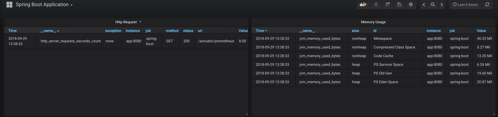
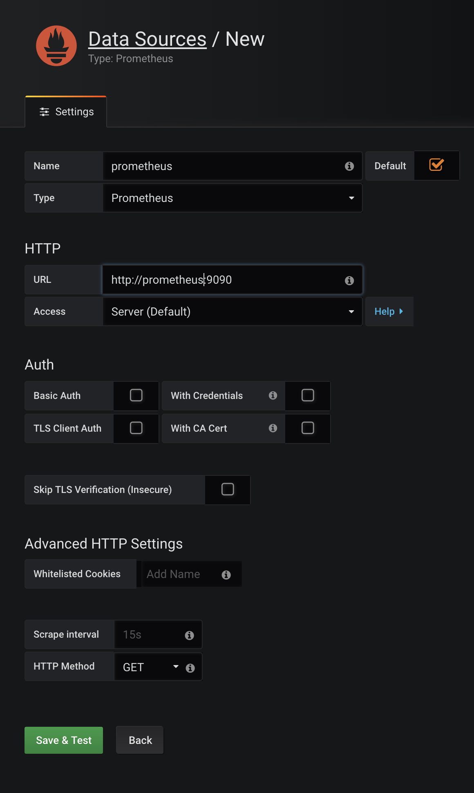
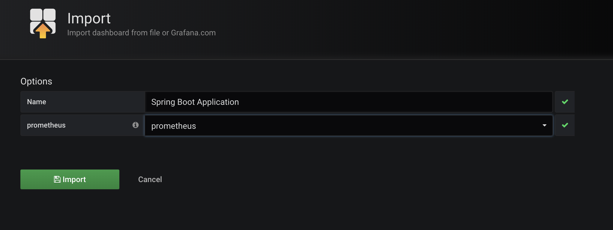

#Sample Application for Spring Boot & Prometheus & Grafana

## Run
You can run everything required with run.sh script.

Run -> ./run.sh up
Down -> ./run.sh down

Script, creates application image and run it with prometheus & grafana via docker-compose.

After all, application can be reached at **localhost:8080**, prometheus also works at **localhost:9090** and grafana works at **localhost:3000**

Import sample dashboard file in the grafana.

## Useful links

localhost:8080/api/v1/orders -> return all orders 

localhost:8080/actuator -> return all actuator endpoints

## SS

Dashboard;

DataSource;

Import Dashboard;
